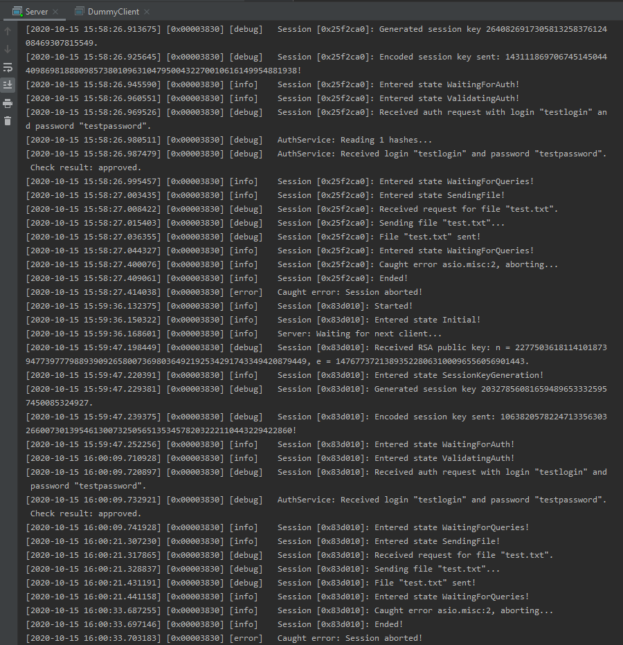

# Лабораторная работа 2, Вариант 7 (Idea + CBC).
 
## Реализация дополнительных заданий

 - :heavy_check_mark: Аутентификация по паролю
 - :cricket: Заменить RSA на GM или ECIES -- экспериментальная реализация GM для Server и DummyClient есть в ветке 
             `lab2_shared_gm`, но на данный момент декодирование недостаточно стабильно и поэтому было решено
             не выключать такую реализацию в релиз для третей лабы.
 - :heavy_check_mark: Добавить срок годности к сеансовому ключу.
 - :heavy_check_mark: Клиент для Android.

## Модули

 - Client -- клиент для Android на QT.
 - Server -- консольный сервер на асинхронных сокетах Boost::ASIO.
 - DummyClient -- простейший тестовый консольный клиент для проверки работоспособности сервера.
 - Shared -- общий код для сервера и клиентов.
 - TestShared -- тесты для общего кода.

## Окружение для сервера

Сервер требует следующего окружения:

 - Папка files с текстовыми файлами, которые могут запросить клиенты. Ожидается, что клиенты пошлют имя файла 
   без префиксов и путь к files будет добавлен в качестве префикса.
 - Файл auth.hashes с данными для идентификации аккаунтов клиентов. Имеет следующий формат: 4-х байтовое число N
   в формате little endian, далее N пар MD5 хэш кода логина с MD5 хэш кодом пароля.
   
Пример окружения можно найти в `Server/EnvironmentExample`. В нём зарегестрирована только одна пара логин/пароль: testlogin/testpassword.

### Примечания

 - В текущий момент в дебажном логе сервер печает сгенерированные и полученные ключи, что небезопасно. 
   Это сделано для упрощения дебага, так как работа учебная.

## Скриншоты

### Сервер

### Клиент

